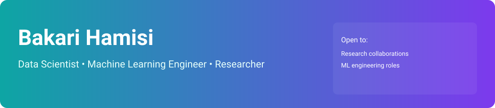

<!--
Epic GitHub Profile README for Bakari Hamisi (Bakari01)
Updated with user's real email and project links.
-->

  

---

  <h1>Hi, I'm Bakari Hamisi </h1>
  <h3>Data Scientist • Machine Learning Engineer • Researcher</h3>
  
<em>Turning data into decisions — building models that scale and systems that ship.</em>

  

    
    
    
  

---

## ⚡ Quick snapshot

- 📍 Based in **Kenya** — building ML systems with a global mindset.
- 🔬 Passionate about **Deep Learning, Reinforcement Learning, and Algorithmic rigor**.
- 🚀 I ship research + production: prototypes, papers, and reproducible pipelines.

---

## 🧭 What I build

| Project | What it does | Why it matters |
|---|---:|---|
| **[Med Cost Prediction](https://github.com/Bakari01/Med_Cost_Prediction.git)** | End-to-end medical cost prediction model and pipeline | Helps forecast patient costs for better resource planning |
| **[Knee Component Sizing Prediction](https://github.com/Bakari01/Predicting-Component-Sizing-in-Primary-Total-Knee-Arthroplasty-using-Demographic-Variables.git)** | Predictive model for component sizing in knee arthroplasty | Aids pre-operative planning and improves outcomes |
| **[TED Talks Segmentation](https://github.com/Bakari01/TED-Talks-Segmentation.git)** | Audio/video segmentation and topic modeling for TED talks | Automates content tagging and retrieval for research |

> Tip: Pin these repos in your GitHub profile to showcase them front-and-center.

---

## 🛠️ Languages & Tools

  
  
  
  
  
  
  

---

## 🔥 Highlights & Metrics

---

## 🧾 Research & Writing

- 📄 **Preprints:** *Improving RL sample efficiency with contextual priors* — (link coming soon)
- ✍️ Blog: Selected deep dives and tutorials on model interpretability and reproducibility.

If you want, I can add an auto-updating “latest blog post” snippet (via RSS → GitHub Actions).

---

## 💼 For recruiters & collaborators

- **Open to:** Research collaborations, ML engineering roles, speaking at conferences.
- **Availability:** Open to remote and hybrid opportunities.
- **Preferred contact:** Drop a message on LinkedIn or email me at `bakarihamisi027@gmail.com`.

---

## 🌟 Fun & Personality

- ☕ Coffee-powered coder. DIY tinkerer. Gym regular.
- 🎧 Current read: *Deep Learning* (Goodfellow) — and an ML research paper a week.

---

## 🧩 How this README works (setup)

1. Create a repo named exactly as your GitHub username (`Bakari01/Bakari01`).
2. Add this `README.md` and commit.
3. For dynamic cards (stats, streaks): use `https://github-readme-stats.vercel.app` and `streak-stats.demolab.com` as shown above. See `anuraghazra/github-readme-stats` for options.
4. Use GitHub Actions to keep content fresh (age, recent activity, latest blog posts). Check `abhisheknaiidu/awesome-github-profile-readme` for action templates.

---

## 📌 Want it even more 🔥?

I included an animated banner SVG (`banner.svg`) and a GitHub Actions workflow that can update this README daily using your blog RSS (if provided) and your GitHub activity. See `.github/workflows/update-readme.yml` and `scripts/update_readme.py`.

---

### Latest blog post (auto-updates with GitHub Action)
<!--BLOG_START-->
_No blog RSS configured yet. To enable: add a repo secret named `BLOG_RSS` with your blog RSS URL._
<!--BLOG_END-->

### Recent activity (auto-updates with GitHub Action)
<!--ACTIVITY_START-->
_No recent activity snapshot yet. When the Action runs it will populate this section._
<!--ACTIVITY_END-->

---

  <b>Enjoyed this? ⭐ Star the README and let's build something amazing.</b>
  
Made with ❤️ for Bakari — customize the placeholders and pin your best projects.

